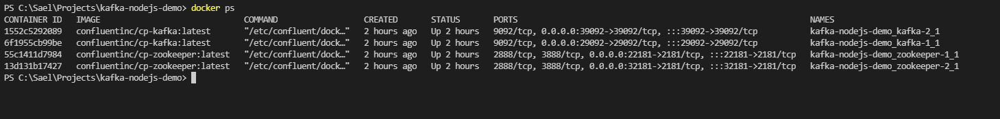
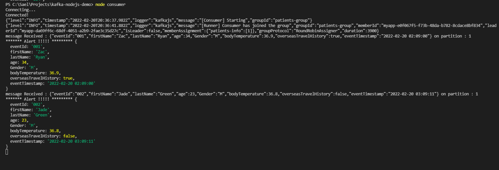
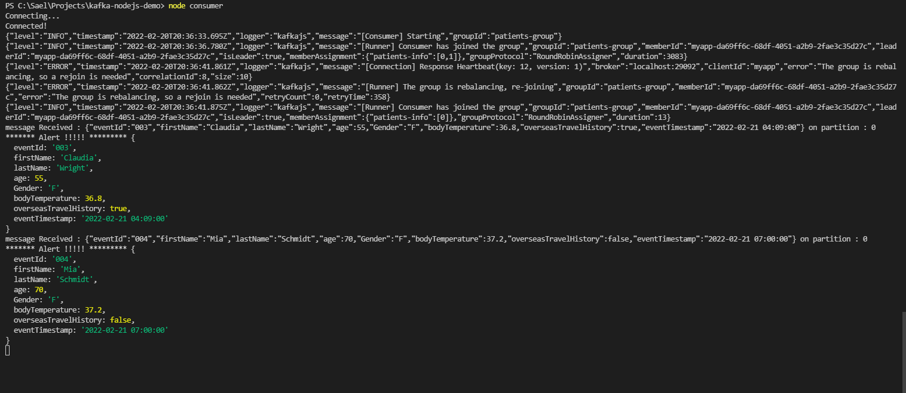
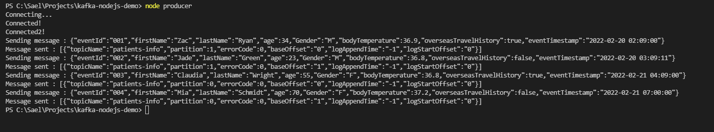

# kafka-nodejs-tutorial
# A sample application using Kafka, Node.js and Docker

#### Table of Content
* [1. About Kafka Streaming](#AboutKafkaStreaming)
* [2. Use case - track travellers who may infected by Coronavirus](#usecase)
* [3. Build local Kafka environemnt using Docker and Container](#build_local_kafka_environemnt)
* [4. Run the application](#run_the_application)
* [References](#references)

<a name="AboutKafkaStreaming"></a>
## 1. About Kafka Streaming

Below is the discription from the official Kafka web site.

Apache Kafka® is a distributed streaming platform.

It publishes and subscribes to streams of records, similar to a message queue or enterprise messaging syste

Kafka is generally used for two broad classes of applications:

Building real-time streaming data pipelines that reliably get data between systems or applications
Building real-time streaming applications that transform or react to the streams of data

To learn more about Kafka, please visit [Kafka official web site](https://kafka.apache.org/)

Kafka is build in Java, it does provide APIs from many other lanhuages.


There are a few libraries for Node.js, some popular libraries include:

* [node-rdkafka](https://github.com/Blizzard/node-rdkafka)

* [Kafka-node](https://www.npmjs.com/package/kafka-node)

* [KafkaJS](https://www.npmjs.com/package/kafkajs) 

I use KafkaJs in this example. The main reason is it has better documentation then the other two.


<a name="usecase"></a>
## 2. Use case - track travellers who may infected by Coronavirus

We are going to build an applicaiton, to track petential travellers who may have been infected by Coronavirus.

1. We check travellers temperature at major airports (I assumed that we have a JSON file of the readings).
2. Assumption here is that every airport is a producer.


<a name="build_local_kafka_environemnt"></a>
## 3. Build local Kafka environemnt using Docker and Container

In order to run the application locally, we need at least two docker images

* zookeeper
* Kafka Broker

I have made a demo of two Kafka brokers, to form a cluster.

Check this docker compose file:

```yml
---
version: '2'
services:
  zookeeper-1:
    image: confluentinc/cp-zookeeper:latest
    environment:
      ZOOKEEPER_CLIENT_PORT: 2181
      ZOOKEEPER_TICK_TIME: 2000
    ports:
      - 22181:2181

  zookeeper-2:
    image: confluentinc/cp-zookeeper:latest
    environment:
      ZOOKEEPER_CLIENT_PORT: 2181
      ZOOKEEPER_TICK_TIME: 2000
    ports:
      - 32181:2181
  
  kafka-1:
    image: confluentinc/cp-kafka:latest
    depends_on:
      - zookeeper-1
      - zookeeper-2

    ports:
      - 29092:29092
    environment:
      KAFKA_BROKER_ID: 1
      KAFKA_ZOOKEEPER_CONNECT: zookeeper-1:2181,zookeeper-2:2181
      KAFKA_ADVERTISED_LISTENERS: PLAINTEXT://kafka-1:9092,PLAINTEXT_HOST://localhost:29092
      KAFKA_LISTENER_SECURITY_PROTOCOL_MAP: PLAINTEXT:PLAINTEXT,PLAINTEXT_HOST:PLAINTEXT
      KAFKA_INTER_BROKER_LISTENER_NAME: PLAINTEXT
      KAFKA_OFFSETS_TOPIC_REPLICATION_FACTOR: 1
  kafka-2:
    image: confluentinc/cp-kafka:latest
    depends_on:
      - zookeeper-1
      - zookeeper-2
    ports:
      - 39092:39092
    environment:
      KAFKA_BROKER_ID: 2
      KAFKA_ZOOKEEPER_CONNECT: zookeeper-1:2181,zookeeper-2:2181
      KAFKA_ADVERTISED_LISTENERS: PLAINTEXT://kafka-2:9092,PLAINTEXT_HOST://localhost:39092
      KAFKA_LISTENER_SECURITY_PROTOCOL_MAP: PLAINTEXT:PLAINTEXT,PLAINTEXT_HOST:PLAINTEXT
      KAFKA_INTER_BROKER_LISTENER_NAME: PLAINTEXT
      KAFKA_OFFSETS_TOPIC_REPLICATION_FACTOR: 1

```

To bring up Kafka containers, run the command below from terminal

```
docker-compose up
```

To check if containers are up and running:




Now we we move to the next step and run the appliction


<a name="run_the_application"></a>
## 4. Run the application


  ### 1. config.js 
 
   It constainers all infrormation to initialise a newK afka client instance. 
   
   ```javascript
module.exports = {
    config: {
        kafka: {
            TOPIC: 'patients-info',
            BROKERS: ["localhost:29092", "localhost:39092"],
            CONSUMER_GROUP_ID: 'patients-group',
            CLIENT_ID: 'myapp',
            NUMBER_OF_PARTITIONS: 2,
            REPLICATION_FACTOR: 2
        }
    }
};
   ```

### 2. topic.js 

  ```
  node topic
  ```
It will create the topic with some configs.

  ### 3. consumer.js

  It listens to the Kafka queue, and process every message coming to the queue. 
  
  
  * initialise a Kafa client and consumer instance
  
  ```javascript
    const kafka = new Kafka({
        clientId: config.kafka.CLIENT_ID,
        brokers : config.kafka.BROKERS,
    });

    const consumer = kafka.consumer({
        groupId: config.kafka.CONSUMER_GROUP_ID
    });
  ```
  
  * process each message coming to the queue, it prints the passenger (or let's call it: patient) information
    
  ```javascript
    await consumer.run({
        eachMessage: async ({ message, partition }) => {
            try {
                console.log(`message Received : ${message.value} on partition : ${partition}`);

                const jsonObj = JSON.parse(message.value.toString());
                console.log(
                    '******* Alert !!!!! *********',
                    jsonObj
                );
                
                } catch (error) {
                console.log('Error while processing message : ', error);
                }
        }
    });
  
  ```
    Run the command below to start consumer.
  
  ```
  node consumer
  ```
You have to run it two times in separates processes, to simulate two consumers in same consumer group.

 If the producer is running (step 3 below), you will see messages coming through..

 This is the messages received - partition 1
  
  

This is the messages received - partition 1
  

  ### 4. producer.js

In the real senario, producer is running on different app, it constantly send message to the queue.

In example, We send mock data (input.json) to simulate a real environment.


  * Initialise a Kafa client and producer instance
  ```javascript
const kafka = new Kafka({
            clientId: config.kafka.CLIENT_ID,
            brokers : config.kafka.BROKERS,
        });

const producer = kafka.producer();

  ```
  
  * I then loop through input.json file, send message every 1 second
  
  ```javascript
for (let step = 0; step < messagesToSend.length; step++) {
    const message = messagesToSend[step];
    console.log(`Sending message : ${JSON.stringify(message)}`);

    const result =  await producer.send({
        topic: config.kafka.TOPIC,
        messages: [
            { 
                value: JSON.stringify(message),
                partition: message.age < 35 ? 1 : 0
            }
        ]
    });

    console.log(`Message sent : ${JSON.stringify(result)}`);

    await delay(2000); //Just for simulation
}
  ```
  
  Run the command below to start producer.
  
  ```
  node producer
  ```
  Message is sent one by one.
  
  
  
  

  ### 5. input.js
  
  This is mock messages we send to Kafka queue as producer, modify the value to see different output.
  
  ```json
  
[
    {
      "eventId": "001",
      "firstName": "Zac",
      "lastName": "Ryan",
      "age": 34,
      "Gender": "M",
      "bodyTemperature": 36.9,
      "overseasTravelHistory": true,
      "eventTimestamp": "2022-02-20 02:09:00"
    },
    {
      "eventId": "002",
      "firstName": "Jade",
      "lastName": "Green",
      "age": 23,
      "Gender": "M",
      "bodyTemperature": 36.8,
      "overseasTravelHistory": false,
      "eventTimestamp": "2022-02-20 03:09:11"
    },
    {
      "eventId": "003",
      "firstName": "Claudia",
      "lastName": "Wright",
      "age": 55,
      "Gender": "F",
      "bodyTemperature": 36.8,
      "overseasTravelHistory": true,
      "eventTimestamp": "2022-02-21 04:09:00"
    },
    {
      "eventId": "004",
      "firstName": "Mia",
      "lastName": "Schmidt",
      "age": 70,
      "Gender": "F",
      "bodyTemperature": 37.2,
      "overseasTravelHistory": false,
      "eventTimestamp": "2022-02-21 07:00:00"
    }
  ]

  ```

<a name="reference"></a>
## References

[Setup Kafka Zookeeper in Docker](https://www.bennettnotes.com/post/setup-kafka-zookeeper-in-docker/)

[Kafka Nodejs Example with Producers and Consumers](https://www.bennettnotes.com/post/kafka-nodejs-example/)

[Kafka Producer and Consumer Examples Using Java](https://dzone.com/articles/kafka-producer-and-consumer-example)

[kafka docker](https://github.com/wurstmeister/kafka-docker)

[Download Kafka (running Kafka locallly without using docker)](https://kafka.apache.org/downloads)
